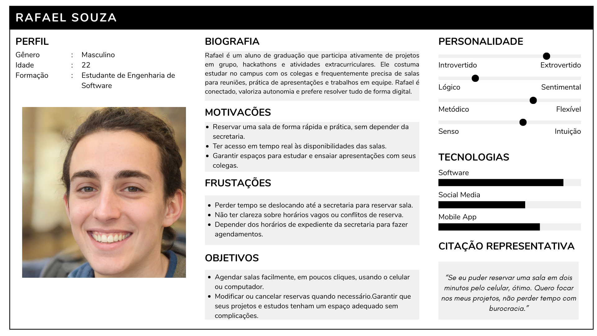
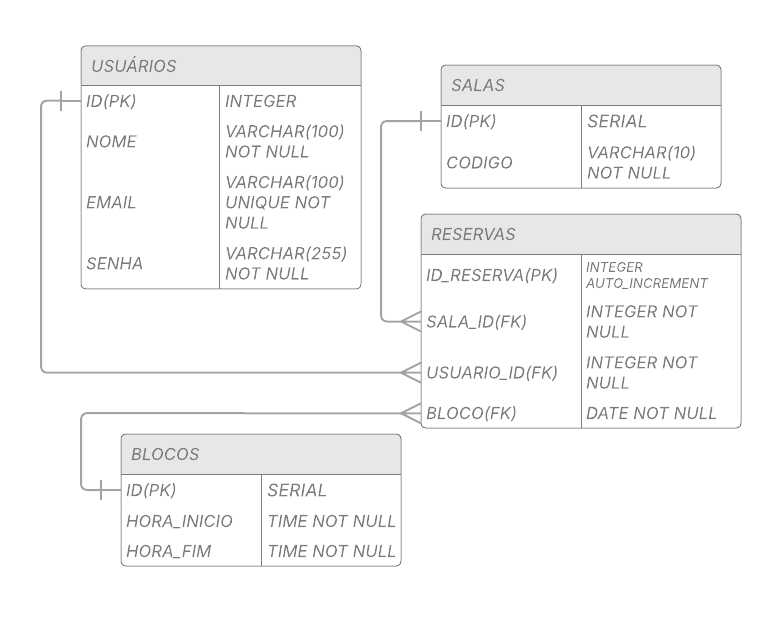
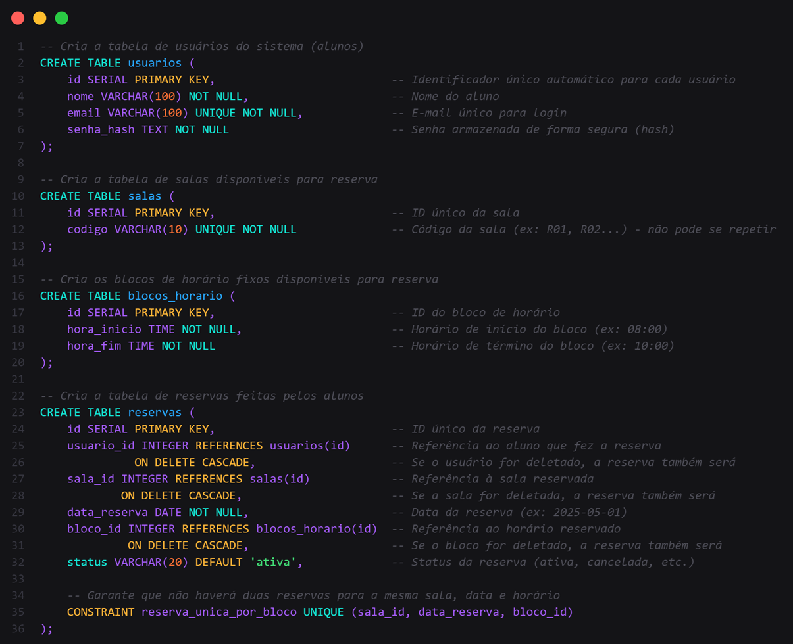
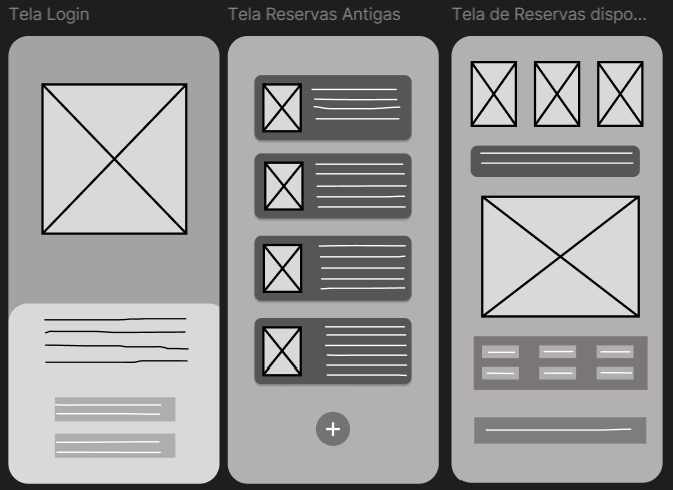

# Web Application Document - Projeto Individual - Módulo 2 - Inteli

**_Os trechos em itálico servem apenas como guia para o preenchimento da seção. Por esse motivo, não devem fazer parte da documentação final._**

## Nome do Projeto
### StudyHub
## Autor do projeto
### João Cardoso Dias

## Sumário

1. [Introdução](#c1)  
2. [Visão Geral da Aplicação Web](#c2)  
3. [Projeto Técnico da Aplicação Web](#c3)  
4. [Desenvolvimento da Aplicação Web](#c4)  
5. [Referências](#c5)  

 

## 1. Introdução (Semana 01)

O atual processo de reserva de salas no Inteli exige que alunos e professores se dirijam pessoalmente à secretaria para solicitar agendamentos. Esse método manual gera desafios significativos: dificuldade em verificar disponibilidades, perda de tempo com deslocamentos e limitações devido aos horários de atendimento. Além disso, a falta de um sistema centralizado torna complicado o gerenciamento dos espaços, levando a conflitos de agendamento e subutilização das salas.

Este projeto propõe uma solução digital para simplificar e modernizar o processo de reserva. A plataforma permitirá que os usuários consultem a disponibilidade das salas em tempo real, realizem agendamentos de forma rápida e gerenciem suas reservas conforme a necessidade. Com uma interface intuitiva, será possível visualizar os horários livres, selecionar o espaço desejado e receber confirmação imediata, tudo de maneira autônoma e sem burocracia.

O objetivo principal é tornar o processo mais eficiente, eliminando barreiras desnecessárias e proporcionando maior autonomia aos usuários. Ao substituir o método manual por uma solução digital, o Inteli dará um passo importante na modernização de seus processos internos, alinhando-se às necessidades de sua comunidade acadêmica. A plataforma não apenas resolverá problemas imediatos, como também servirá como base para futuras melhorias na gestão de espaços e recursos compartilhados.

---

## 2. Visão Geral da Aplicação Web

### 2.1. Personas (Semana 01)
A criação de personas, conforme Cooper et al. (2007), não se limita à simples elaboração de perfis fictícios, mas constitui um processo estratégico que transforma dados de pesquisa em representações tangíveis dos usuários. Essa abordagem foi fundamental no desenvolvimento do StudyHub, onde a persona "Rafael Souza" emergiu não como uma mera personificação abstrata, mas como uma síntese cuidadosa das observações sobre o comportamento real dos alunos - seus hábitos de estudo, frustrações com o sistema atual e necessidades não atendidas.

Essa materialização das personas ganha ainda mais relevância quando consideramos o alerta de Pruitt e Adlin (2006) sobre os riscos do design baseado em suposições. No projeto do Inteli, a persona de Lucas serviu como bússola em momentos decisivos: quando a equipe debatia entre desenvolver uma solução mobile-first ou priorizar a versão desktop, foi o entendimento profundo da rotina acelerada de Lucas - que precisa agendar salas entre aulas usando principalmente o celular - que direcionou a escolha para o mobile. Dessa forma, a persona deixou de ser apenas uma referência passiva para se tornar um agente ativo no processo de tomada de decisão.

A eficácia desse método encontra sua comprovação nos estudos de Nielsen (2012), que correlaciona diretamente o uso de personas bem construídas com a qualidade final da experiência do usuário. No caso do Inteli, essa relação tornou-se visível quando o sistema em desenvolvimento começou a antecipar necessidades que nem mesmo os próprios alunos haviam verbalizado claramente - como a funcionalidade de "reserva relâmpago" para intervalos curtos entre aulas, inspirada na análise minuciosa dos padrões de comportamento da persona Lucas. Assim, o que começou como uma ferramenta de design transformou-se no próprio mecanismo que assegurou a adesão espontânea dos usuários ao novo sistema.

---

    
<strong>Figura 1</strong> – Representação de uma persona
    
    

        Fonte:Produção Autoral.
    

### 2.2. User Stories (Semana 01)

A elaboração de user stories, conforme proposto por Cohn (2004), vai além da simples listagem de requisitos - ela estabelece um diálogo contínuo entre as necessidades dos usuários e as soluções técnicas. No projeto do Sistema de Reserva de Salas do Inteli, esse conceito se materializou quando transformamos observações do cotidiano acadêmico (como a correria entre aulas para reservar espaços) em narrativas estruturadas. A user story "Como Lucas, quero ver salas disponíveis num relance para aproveitar intervalos entre aulas" não apenas definiu uma funcionalidade, mas capturou um padrão comportamental crítico dos alunos.

Essa abordagem encontra eco nos princípios de Jeffries e Anderson (2001), que defendem user stories como unidades vivas de comunicação, não como documentos estáticos. Durante as iterações do projeto no Inteli, cada user story funcionou como um pacto colaborativo: enquanto a equipe técnica garantia que "reservas com um clique" fossem viáveis, os usuários validavam que a solução realmente economizava seu tempo. Esse feedback contínuo permitiu que histórias inicialmente simples, como "cancelar reservas", evoluíssem para fluxos mais robustos que consideravam conflitos de horário e notificações automáticas.

O verdadeiro poder dessa metodologia, como sintetiza Rubin (2012), revela-se quando as user stories passam a formar um sistema orgânico de prioridades. No caso do Inteli, a conexão entre histórias aparentemente isoladas - como "visualizar disponibilidade", "fazer reservas rápidas" e "gerenciar agendamentos" - mostrou-se fundamental para criar uma experiência coesa. O sistema resultante não apenas resolveu problemas individuais, mas transformou todo o ecossistema de reservas, provando que user stories bem articuladas são a base para produtos que realmente compreendem e servem seus usuários.

---
| Elemento        | Descrição                                                                 |
|-----------------|---------------------------------------------------------------------------|
| **ID**         | US01                                                                     |
| **Título**     | Visualização de disponibilidade                                          |
| **Persona**    | Rafael Souza (aluno do 3° período)                                      |
| **Como**       | Aluno que precisa agendar salas para trabalhos em grupo                 |
| **Quero**      | Ver disponibilidade das salas em tempo real                             |
| **Para**       | Planejar meus estudos sem precisar ir à secretaria                      |
| **Critérios**  | 1. Lista salas filtradas por data/horário 2. Mostra status visual (livre/ocupado) 3. Permite pré-selecionar intervalo |
| **Prioridade** | Alta (Core do MVP)                                                      |

| Atributo INVEST | Aplicação na US01                                                                 | Justificativa                                                                 |
|-----------------|-----------------------------------------------------------------------------------|-------------------------------------------------------------------------------|
| **I**ndependente | Funcionalidade completa que não depende de outras US para funcionar                | Pode ser implementada mesmo sem o sistema de reserva estar completo           |
| **N**egociável  | Detalhes da interface podem ser ajustados (tipo de calendário, cores dos status)   | O essencial é mostrar disponibilidade, a forma pode variar                    |
| **V**aliosa     | Resolve a principal dor do Lucas (saber se a sala está livre sem deslocamento)     | Economiza tempo e dá autonomia ao aluno                                       |
| **E**stimável   | Complexidade bem delimitada (~3 dias de desenvolvimento)                           | Requer apenas: lista de salas + lógica de disponibilidade + interface simples |
| **S**mall       | Escopo contido (pode ser entregue em 1 sprint)                                     | Funcionalidade focada sem sub-itens complexos                                 |
| **T**estável    | Critérios de aceite claros e verificáveis                                          | Pode-se testar: filtros funcionam? Status visualizado corretamente?           |

---
| Campo               | Descrição                                                                 |
|---------------------|---------------------------------------------------------------------------|
| **ID**              | US02                                                                     |
| **Título**          | Reserva rápida                                                           |
| **Persona**         | Rafael Souza (com prazo apertado)                                        |
| **Como**            | Aluno precisando agendar sala urgentemente                               |
| **Quero**           | Reservar uma sala em poucos passos pelo celular                          |
| **Para**            | Não perder tempo com deslocamento até a secretaria                       |
| **Critérios Aceite** | - Fluxo máximo de 3 etapas - Campos mínimos obrigatórios - Confirmação imediata |
| **Prioridade**      | Média                                                                     |
---
| Campo               | Descrição                                                                 |
|---------------------|---------------------------------------------------------------------------|
| **ID**              | US03                                                                     |
| **Título**          | Gerenciamento de reservas                                                |
| **Persona**         | Rafael Souza (com planos alterados)                                      |
| **Como**            | Aluno que precisa reorganizar agendas                                    |
| **Quero**           | Cancelar ou modificar minhas reservas existentes                         |
| **Para**            | Me adaptar a mudanças no cronograma do grupo                             |
| **Critérios Aceite** | - Lista minhas reservas ativas - Cancelamento com 1h antecedência - Notificação por e-mail |
| **Prioridade**      | Média                                                                     |

## 3. Projeto da Aplicação Web

### 3.1. Modelagem do banco de dados  (Semana 3)

    
<strong>Figura 2</strong> – Representação do diagrama de modelos relacionais

    
    

        Fonte:Produção Autoral.
    

    
<strong>Figura 3</strong> – Representação do arquivo  .sql 

    
    

        Fonte:Produção Autoral.
    

#

### 3.1.1 BD e Models (Semana 5)
*Descreva aqui os Models implementados no sistema web*

### 3.2. Arquitetura (Semana 5)

*Posicione aqui o diagrama de arquitetura da sua solução de aplicação web. Atualize sempre que necessário.*

**Instruções para criação do diagrama de arquitetura**  
- **Model**: A camada que lida com a lógica de negócios e interage com o banco de dados.
- **View**: A camada responsável pela interface de usuário.
- **Controller**: A camada que recebe as requisições, processa as ações e atualiza o modelo e a visualização.
  
*Adicione as setas e explicações sobre como os dados fluem entre o Model, Controller e View.*

### 3.3. Wireframes (Semana 03)

Wireframes são representações visuais simplificadas da estrutura de uma interface, geralmente utilizadas nas etapas iniciais do design de produtos digitais. Eles descrevem o layout de uma página sem se preocupar com detalhes estéticos, focando apenas na organização dos elementos e na hierarquia da informação. Segundo Garrett (2011), os wireframes são essenciais para mapear como o usuário interage com o sistema, permitindo antecipar problemas de usabilidade e otimizar a navegação.

A principal importância dos wireframes está na sua capacidade de facilitar a comunicação entre designers, desenvolvedores e stakeholders. Eles funcionam como um guia visual que alinha expectativas e reduz retrabalho, permitindo validar a lógica e o fluxo das interfaces antes da implementação técnica (Krug, 2014). Além disso, wireframes servem como uma base para testes iniciais de usabilidade e feedback de usuários, contribuindo para soluções mais eficientes e centradas no usuário.

    
<strong>Figura 3</strong> – Representação do  Wireframe

    
    

        Fonte:Produção Autoral.
    

### 3.4. Guia de estilos (Semana 05)

*Descreva aqui orientações gerais para o leitor sobre como utilizar os componentes do guia de estilos de sua solução.*

### 3.5. Protótipo de alta fidelidade (Semana 05)

*Posicione aqui algumas imagens demonstrativas de seu protótipo de alta fidelidade e o link para acesso ao protótipo completo (mantenha o link sempre público para visualização).*

### 3.6. WebAPI e endpoints (Semana 05)

*Utilize um link para outra página de documentação contendo a descrição completa de cada endpoint. Ou descreva aqui cada endpoint criado para seu sistema.*  

### 3.7 Interface e Navegação (Semana 07)

*Descreva e ilustre aqui o desenvolvimento do frontend do sistema web, explicando brevemente o que foi entregue em termos de código e sistema. Utilize prints de tela para ilustrar.*

---

## 4. Desenvolvimento da Aplicação Web (Semana 8)

### 4.1 Demonstração do Sistema Web (Semana 8)

*VIDEO: Insira o link do vídeo demonstrativo nesta seção*
*Descreva e ilustre aqui o desenvolvimento do sistema web completo, explicando brevemente o que foi entregue em termos de código e sistema. Utilize prints de tela para ilustrar.*

### 4.2 Conclusões e Trabalhos Futuros (Semana 8)

*Indique pontos fortes e pontos a melhorar de maneira geral.*
*Relacione também quaisquer outras ideias que você tenha para melhorias futuras.*

## 5. Referências

COHN, M. *User stories applied: for agile software development*. Boston: Addison-Wesley, 2004.

COOPER, A. et al. *About face 3: the essentials of interaction design*. Indianapolis: Wiley, 2007.

JEFFRIES, R.; ANDERSON, A. *Extreme programming installed*. Boston: Addison-Wesley, 2001.

NIELSEN, J. *Usability engineering*. San Francisco: Morgan Kaufmann, 2012.

PRUITT, J.; ADLIN, T. *The persona lifecycle: keeping people in mind throughout product design*. San Francisco: Morgan Kaufmann, 2006.

RUBIN, K. S. *Essential Scrum: a practical guide to the most popular agile process*. Boston: Addison-Wesley, 2012.
Garrett, J. J. (2011). The Elements of User Experience: User-Centered Design for the Web and Beyond. New Riders.

Krug, S. (2014). Don't Make Me Think, Revisited: A Common Sense Approach to Web Usability. New Riders.

---